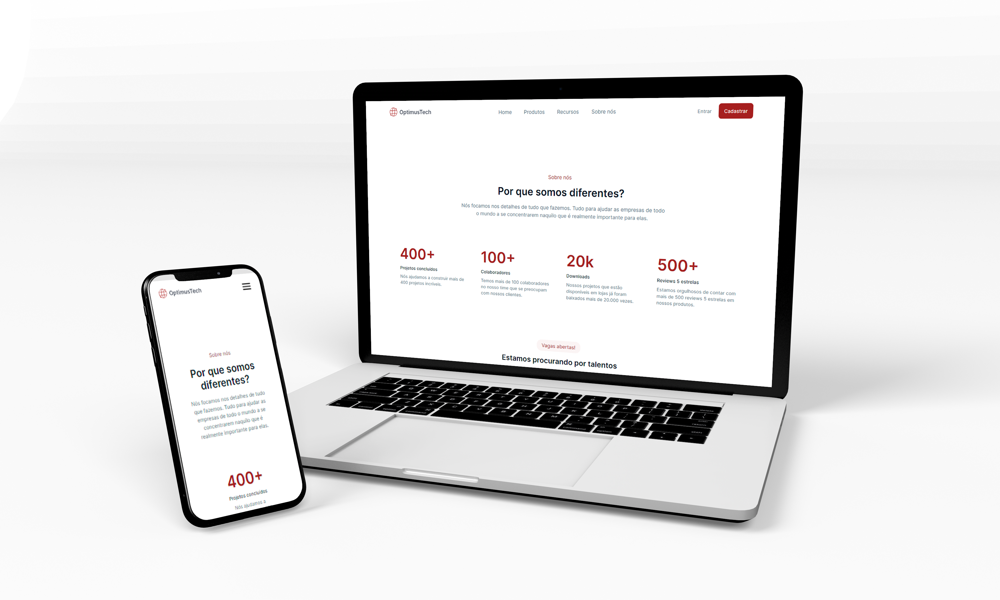

  <p align="center">
    
  </p>
  
  <p align="center">
    
  </p>
  
  ## :clipboard: Sobre o Projeto
  
  Esse projeto foi realizado para o desafio #7DaysOfCode no qual foi criado pela a [Giovanna Moeller](https://github.com/giovannamoeller) em parceria com a [Alura](https://www.alura.com.br/), uma empresa de educação em tecnologia.
  
  O designer do projeto foi construído no [Figma](https://www.figma.com/). Basta [acessar esse link](https://www.figma.com/file/mm3MLozvUDGhDRTxSLlGL5/7daysOfCode-HTML-CSS?node-id=0%3A1&utm_source=ActiveCampaign&utm_medium=email&utm_content=%237DaysOfCode+-+HTML+e+CSS+1%2F7%3A+Cabe%C3%A7alho&utm_campaign=%5BAlura+%237Days+of+Code%5D%28HTML+++CSS%29+Dia+1%3A+Cabe%C3%A7alho) e você já vai conseguir visualizar o layout! O  seu objetivo teve como, as pessoas reproduzirem o layout feito no Figma utilizando as tecnolias como HTML e CSS é praticar tudo o que já foi aprendido sobre ela.
Para que possamos aprimorar nosso conhecimento nas linguagens de desenvolvimento e possamos a coloca-la em pratica. 
 
  Espero que gostem! 🙃
  
  <br>
  <p align="center">
    
  </p>
  <br>
  
  ## :computer: Tecnologias utilizadas
  
  O projeto foi desenvolvido utilizando as seguintes tecnologias:
  
  - [HTML](https://developer.mozilla.org/pt-BR/docs/Web/HTML)
  - [CSS](https://developer.mozilla.org/pt-BR/docs/Web/CSS)
  - [JavaScript](https://www.javascript.com/)

## 🕵️‍♂️ Para clonar o repositório utilize:
```bash
 git clone hhttps://github.com/degabrielofi/7DaysOfCode
```

 ## 

## 😃 Se achou legal? Me segue lá no > [Likedln](https://www.linkedin.com/in/degabrielofi/)

